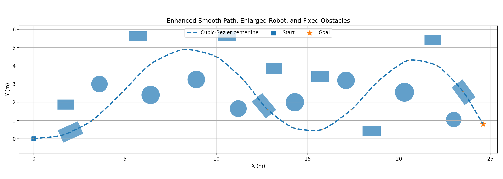
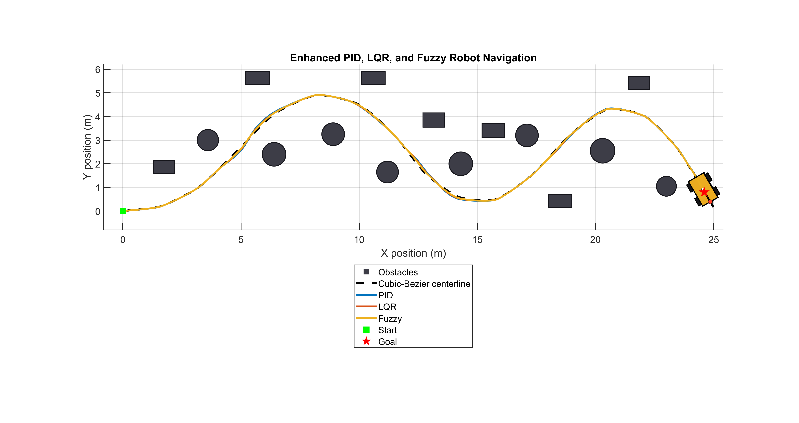
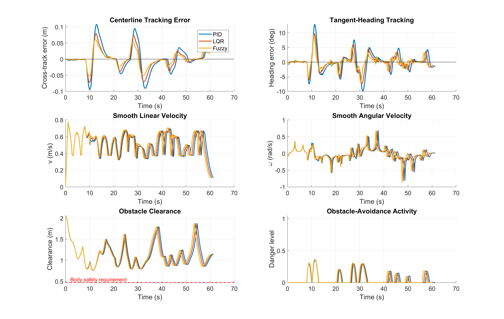
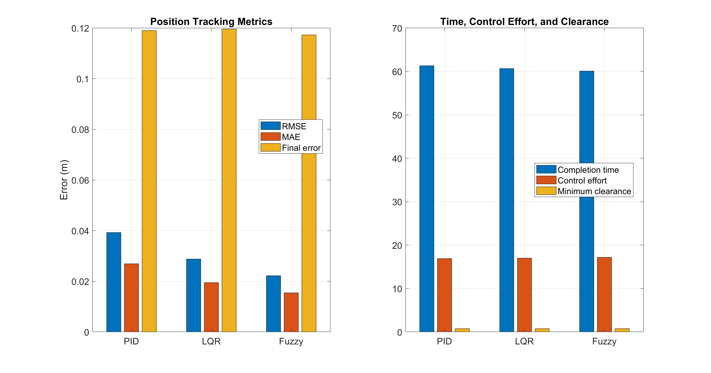
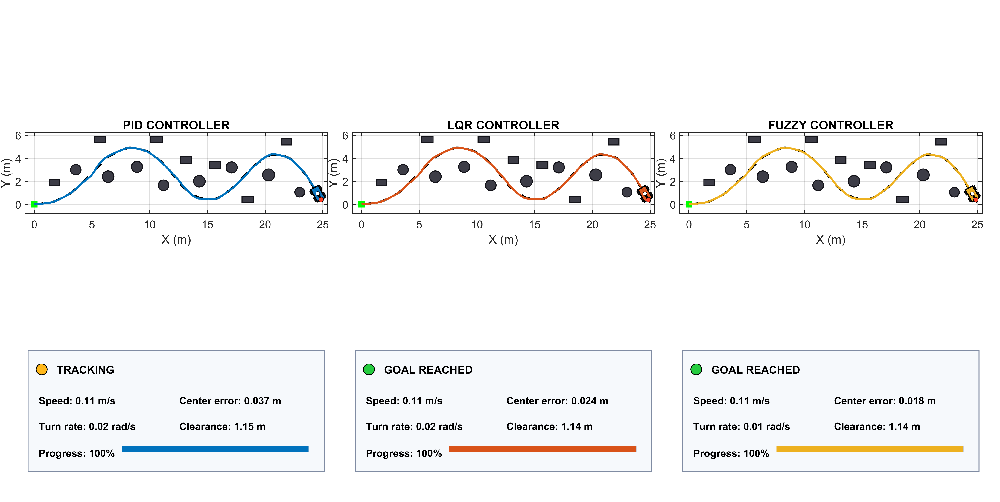

# Comparative Mobile-Robot Trajectory Tracking Using PID, LQR, and Fuzzy Control

## Project overview

This repository presents a MATLAB-based comparative study of **PID**,
**Linear Quadratic Regulator (LQR)**, and **Fuzzy Logic** control for mobile-robot
trajectory tracking. Each controller is evaluated using the same robot model,
reference path, obstacle map, initial condition, and motion constraints.

The simulation combines a differential-drive/unicycle kinematic model, a
smooth cubic Bezier trajectory, curvature-aware speed planning, Frenet-frame
tracking errors, obstacle avoidance, and oriented-body collision checking. The
LQR and fuzzy controllers are implemented directly in MATLAB without the
Control System Toolbox or Fuzzy Logic Toolbox.

**Portfolio focus:** mobile robotics, feedback control, autonomous navigation,
robot kinematics, safety-aware motion, and quantitative controller evaluation.



## Key features

- Side-by-side evaluation of PID, LQR, and fuzzy trajectory tracking
- C1-continuous cubic Bezier reference path with tangent and curvature data
- Frenet-frame lateral, longitudinal, and heading-error calculation
- Curvature-aware reference speed and acceleration-rate limiting
- Shared artificial-potential-field-style obstacle avoidance
- Collision checking for the robot's oriented rectangular body
- Circular and rectangular obstacle support
- Tracking, safety, command-effort, and completion-time metrics
- Comparison figures, an animated MP4, a CSV report, and a MAT results file
- Reproducible default run through a fixed random seed

## Robotics and automation relevance

This project demonstrates several core competencies used in robotics and
automation:

- **Closed-loop control:** converts position and heading errors into real-time
  velocity commands.
- **Controller design:** compares classical, optimal, and rule-based control
  approaches within one consistent framework.
- **Robot modeling:** applies a differential-drive/unicycle kinematic model
  with linear and angular motion constraints.
- **Trajectory generation:** creates a continuous path and extracts tangent,
  curvature, and speed references.
- **Autonomous navigation:** combines path tracking with obstacle-aware motion
  correction and collision protection.
- **Performance evaluation:** measures accuracy, safety, completion time,
  control effort, and travel distance using reproducible metrics.
- **Technical communication:** provides source code, numerical results,
  figures, an animation, and supporting project documentation.

## Engineering contributions

- Implemented three controllers behind a common simulation interface.
- Implemented a toolbox-free iterative Riccati solution for discrete LQR.
- Built a toolbox-free Sugeno-style fuzzy steering controller.
- Generated a C1-continuous cubic Bezier path and resampled it by arc length.
- Added curvature-dependent reference velocity for smoother turning behavior.
- Separated controller tracking logic from the shared obstacle-avoidance and
  collision-protection layers.
- Added oriented-rectangle collision tests against circular obstacles,
  rectangular obstacles, and world boundaries.
- Automated metric calculation, visualization, video generation, and result
  export for repeatable controller comparison.

## Controller comparison

| Controller | Implementation |
| --- | --- |
| PID | Lateral- and heading-error feedback with integral limiting, filtered derivative terms, and velocity adaptation |
| LQR | Discrete Frenet-frame feedback with an iterative Riccati solver implemented directly in MATLAB |
| Fuzzy | Toolbox-free Sugeno-style steering using five membership levels for lateral and heading errors |

All three controllers receive the same reference state and use the same
obstacle-avoidance, collision-protection, velocity-limit, and acceleration-limit
logic. This keeps the comparison focused on the tracking controllers.

## Requirements

- MATLAB R2019b or newer is recommended
- No Control System Toolbox is required
- No Fuzzy Logic Toolbox is required
- A MATLAB-supported video writer is needed to create the MP4 output

## Quick start

1. Clone the repository:

   ```bash
   git clone https://github.com/ruddrho/pid-lqr-fuzzy-mobile-robot-trajectory-tracking.git
   ```

2. Open the cloned directory as the MATLAB **Current Folder**.

3. Run:

   ```matlab
   main
   ```

The script simulates all three controllers and saves new artifacts in the
`results/` directory.

## Simulation workflow

1. `projectConfig.m` defines the robot geometry, constraints, sample time, and
   output settings.
2. `projectEnvironment.m` creates the fixed start, goal, and obstacle map.
3. `generateReferencePath.m` constructs and validates the cubic Bezier path.
4. `simulateController.m` runs each controller with the shared safety layers.
5. `calculateMetrics.m` measures tracking accuracy, safety, effort, and travel.
6. The visualization functions create the comparison figures and animation.

## Evaluation methodology

The comparison holds the following elements constant for all controllers:

- robot dimensions and kinematic model
- start pose, goal position, and reference trajectory
- circular and rectangular obstacle locations
- simulation step size and maximum duration
- linear and angular velocity limits
- acceleration and angular-acceleration limits
- obstacle-avoidance and collision-protection logic
- goal tolerance and metric definitions

The default simulation uses a fixed seed and disabled disturbances. This makes
the bundled comparison deterministic, but it does not represent a statistical
robustness study.

## Results and analysis

The following values come from the bundled `controller_metrics.csv` file. They
represent the repository's default configuration and should be recalculated
after changing controller gains, the path, the environment, or robot settings.

### Tracking accuracy

| Controller | Cross-track RMSE (m) | Cross-track MAE (m) | Maximum cross-track error (m) | Heading RMSE (deg) | Final position error (m) |
| --- | ---: | ---: | ---: | ---: | ---: |
| PID | 0.0392 | 0.0269 | 0.1082 | 3.3027 | 0.1190 |
| LQR | 0.0288 | 0.0195 | 0.0794 | 2.5333 | 0.1195 |
| Fuzzy | 0.0222 | 0.0154 | 0.0604 | 1.9432 | 0.1172 |

### Navigation and control performance

| Controller | Goal reached | Collision | Guard activations | Minimum clearance (m) | Completion time (s) | Travel distance (m) | Control effort |
| --- | ---: | ---: | ---: | ---: | ---: | ---: | ---: |
| PID | Yes | No | 0 | 0.7600 | 61.29 | 30.9311 | 16.9179 |
| LQR | Yes | No | 0 | 0.7625 | 60.66 | 30.8865 | 17.0118 |
| Fuzzy | Yes | No | 0 | 0.7679 | 60.06 | 30.8777 | 17.1917 |

### Interpretation

- All three controllers reached the goal without collision or collision-guard
  activation in the default scenario.
- The fuzzy controller recorded the lowest cross-track RMSE, heading RMSE,
  final position error, completion time, and travel distance.
- The PID controller recorded the lowest control-effort value, indicating a
  small accuracy-versus-effort tradeoff in this run.
- LQR performance remained between PID and fuzzy control for most reported
  tracking metrics.
- These findings apply only to the included path, controller settings, and
  obstacle environment. They do not establish a universal ranking.

### Trajectory tracking

The planned path and the trajectories produced by all three controllers are
shown below. The figure also presents the shared obstacle environment and the
robots' final positions.



### Tracking errors and control commands

This figure compares the cross-track error, heading error, linear velocity,
and angular velocity recorded during each simulation.



### Performance metrics

The main accuracy, safety, completion-time, and control-effort metrics are
summarized visually below.



### Final animation frame

The final dashboard displays the robot states, route progress, speed, angular
rate, centerline error, and obstacle clearance for all three controllers.



### Simulation video

[Watch or download the complete controller comparison animation](controller_comparison.mp4)

## Generated outputs

Running `main.m` creates the following files in `results/`:

| File | Description |
| --- | --- |
| `controller_metrics.csv` | Numerical comparison of tracking, safety, effort, and travel metrics |
| `trajectory_comparison.png` | Reference and actual trajectories for the three controllers |
| `errors_and_commands.png` | Tracking-error and control-command histories |
| `metric_comparison.png` | Visual comparison of the principal performance metrics |
| `final_animation_frame.png` | Final state of the three-panel animation |
| `controller_comparison.mp4` | Animated controller comparison, when video writing is supported |
| `simulation_results.mat` | Configuration, environment, path, state histories, and metrics |

## Project structure

```text
.
|-- main.m                         Main entry point
|-- projectConfig.m                Simulation and robot settings
|-- projectEnvironment.m           Start, goal, and obstacle definitions
|-- generateReferencePath.m        Cubic Bezier path generation
|-- simulateController.m           Shared simulation loop
|-- pidController.m                PID controller
|-- lqrController.m                Toolbox-free LQR controller
|-- fuzzyController.m              Toolbox-free fuzzy controller
|-- obstacleAvoidance.m            Obstacle-avoidance correction
|-- robotCollides.m                Oriented-body collision test
|-- calculateMetrics.m             Performance metrics
|-- visualizeComparison.m          Static comparison figures
|-- animateControllers.m           Three-panel animation and video
|-- PROJECT_REPORT.md              Design overview
`-- ALGORITHMS_SUMMARY.md          Concise algorithm notes
```

## Configuration

Edit `projectConfig.m` to change settings such as:

- sample time and maximum simulation duration
- linear and angular velocity limits
- linear and angular acceleration limits
- robot dimensions and safety margin
- Bezier sampling and curvature-speed parameters
- obstacle-avoidance influence distance and steering gain
- animation stride, frame rate, and video generation

Edit `projectEnvironment.m` to change the start position, goal position, or
circular and rectangular obstacles. Controller gains and rule parameters are
defined in their respective controller files.

## Compatibility notes

- Controller results are first stored in cell arrays and combined afterward,
  avoiding MATLAB's `Subscripted assignment between dissimilar structures`
  error in affected releases.
- The project directory is placed at the beginning of the MATLAB search path
  so that older duplicate controller files are not selected accidentally.
- The visualization avoids unsupported `DisplayName` use on `rectangle`
  objects and uses a backward-compatible reference-line implementation.
- Animation dimensions are fixed to improve H.264 video compatibility.

## Scope and limitations

- The study uses a two-dimensional kinematic simulation rather than a full
  electromechanical robot model.
- Robot pose is available directly to the controller; sensor noise and state
  estimation are not modeled in the default run.
- Obstacles are static and known before the simulation begins.
- Wheel slip, actuator dynamics, communication delay, and motor saturation
  beyond the configured command limits are not modeled.
- Default disturbances are disabled, and the bundled results cover one fixed
  route and obstacle arrangement.
- The controllers have not been validated on physical hardware in this
  repository.

## Future development

- Run repeated disturbance and parameter-variation experiments to evaluate
  controller robustness statistically.
- Add noisy range and pose measurements with an Extended Kalman Filter or a
  comparable state estimator.
- Test dynamic-obstacle handling and online local-path replanning.
- Integrate the controllers with ROS 2 and a robotics simulator.
- Validate the control architecture on a differential-drive mobile robot.
- Compare the current methods with model predictive control and modern
  nonlinear tracking approaches under the same evaluation protocol.

## Documentation

- [Project report](PROJECT_REPORT.md)
- [Algorithms summary](ALGORITHMS_SUMMARY.md)

## License

This project is available under the [MIT License](LICENSE).
